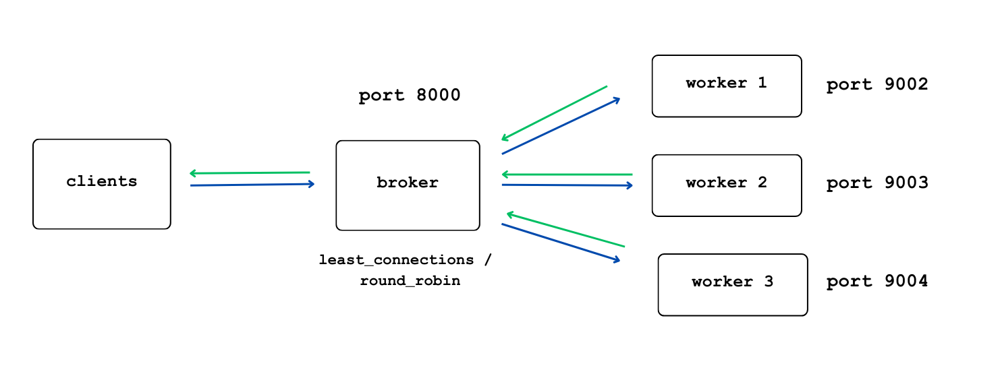

Simulasi Load Balancing Phyton
---
Repositori ini dibuat untuk memenuhi tugas pada mata kuliah Komunikasi Berbasis Jaringan. Di dalam repositori ini terdapat kode dan dokumentasi yang membangun sistem load balancer sederhana menggunakan Python.

# Deskripsi repositori
1. Client Mengirim Permintaan ke Broker:
Client mengirimkan permintaan (request) ke server broker. Permintaan biasanya menyertakan parameter appID untuk menentukan jenis proses yang akan dijalankan, seperti proses "long" atau "short".
2. Broker Menerima dan Menganalisis Permintaan:
Broker menerima permintaan dari client dan menganalisisnya. Berdasarkan pendekatan yang ditentukan (least_connections atau round_robin), broker akan memilih worker yang sesuai untuk menangani permintaan tersebut.
3. Broker Mengirim Permintaan ke Worker yang Dipilih:
Setelah memilih worker, broker menghubungi worker tersebut melalui salah satu port yang telah dikonfigurasi (9002, 9003, atau 9004) sesuai worker yang dipilih. Broker kemudian meneruskan permintaan dari client ke worker untuk diproses lebih lanjut.
4. Worker Memproses Permintaan dan Memberikan Respons:
Worker yang dipilih oleh broker akan menerima permintaan dan melakukan pemrosesan berdasarkan appID. Misalnya, jika appID adalah "long," worker akan menjalankan proses yang memakan waktu lebih lama dibandingkan dengan appID "short."
Setelah memproses permintaan, worker mengirimkan hasil atau respons kembali ke broker.
5. Broker Meneruskan Respons ke Client:
Broker menerima respons dari worker setelah proses selesai. Kemudian, broker meneruskan respons ini ke client yang mengirimkan permintaan awal.
6. Client Menerima Respons:
Client menerima respons dari broker, yang berisi hasil dari pemrosesan data yang dilakukan oleh worker.

## Direktori `codes`:
1. `client.py` - *Mensimulasikan pengiriman request dari client ke server*
2. `broker.py` - *Menerima permintaan dari client dan mengarahkan ke worker yang sesuai*
3. `worker.py` - *Menangani permintaan client dan mengirimkan respons kembali*

## Direktori `documentation`:
1. `dokumentasi.pdf` - *penjelasan load balancing, overview client.py, broker.py, worker.py, dan simulasi*

# Informasi mahasiswa
Nama : Nurun Nafisah
NIM  : 24051905002